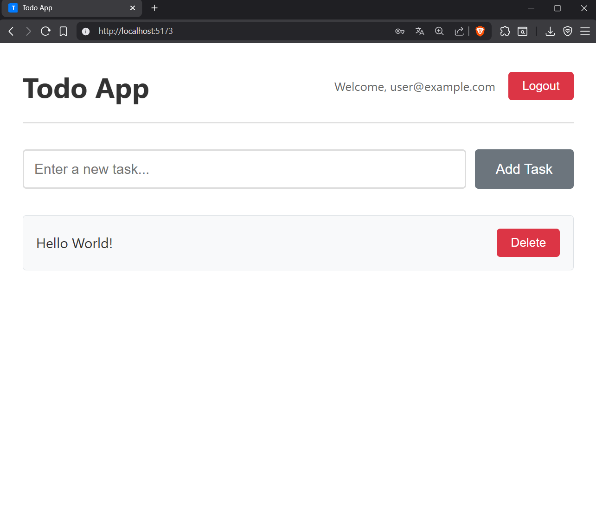

# Todo App

A full-stack web application for managing tasks with user authentication. Built with React, Node.js, Express, and PostgreSQL.


## 📷 picture of working front end
 

## 📋 Table of Contents

- [Features](#features)
- [Demo](#demo)
- [Tech Stack](#tech-stack)
- [Prerequisites](#prerequisites)
- [Installation](#installation)
- [Configuration](#configuration)
- [Running the Application](#running-the-application)
- [Testing](#testing)
- [Project Structure](#project-structure)
- [API Documentation](#api-documentation)
- [Architecture](#architecture)
- [Contributing](#contributing)
- [License](#license)

## ✨ Features

- **User Authentication**
  - Secure signup and login with JWT
  - Password hashing with bcrypt
  - Protected routes
  - Session persistence

- **Task Management**
  - Create new tasks
  - View all tasks
  - Delete tasks
  - Real-time updates

- **User Experience**
  - Responsive design
  - Loading states
  - Error handling
  - Form validation
  - Clean, modern UI

- **Code Quality**
  - MVC architecture
  - Component-based design
  - Comprehensive test suite (16 tests)
  - Detailed logging system

## 🎥 Demo

### Authentication Flow
```
1. Visit http://localhost:5173/signup
2. Create an account
3. Automatically redirected to login
4. Sign in with credentials
5. Access the main todo app
6. Logout when done
```

### Task Management
```
1. Add tasks using the input form
2. View all tasks in a list
3. Delete tasks with one click
4. Tasks persist in database
```

## 🛠 Tech Stack

### Frontend
- **React 18** - UI library
- **React Router v6** - Client-side routing
- **Context API** - State management
- **Vite** - Build tool
- **CSS3** - Styling

### Backend
- **Node.js** - Runtime environment
- **Express.js** - Web framework
- **PostgreSQL** - Database
- **JWT** - Authentication tokens
- **bcrypt** - Password hashing

### Testing
- **Mocha** - Test framework
- **Chai** - Assertion library
- **Custom Logger** - Test reporting

## 📦 Prerequisites

Before you begin, ensure you have the following installed:

- **Node.js** (v16 or higher)
  - Download: https://nodejs.org/
  - Check version: `node --version`

- **PostgreSQL** (v12 or higher)
  - Download: https://www.postgresql.org/download/
  - Check version: `psql --version`

- **npm** (comes with Node.js)
  - Check version: `npm --version`

## 🚀 Installation

### 1. Clone the Repository

```bash
git clone <repository-url>
cd todo-app
```

### 2. Install Backend Dependencies

```bash
cd server
npm install
```

### 3. Install Frontend Dependencies

```bash
cd ../client
npm install
```

### 4. Setup Database

#### Create Databases

```bash
# Connect to PostgreSQL
psql -U postgres

# Create development database
CREATE DATABASE todo;

# Create test database
CREATE DATABASE test_todo;

# Exit psql
\q
```

#### Initialize Database Schema

```bash
cd server
psql -U postgres -d todo -f db.sql
psql -U postgres -d test_todo -f db.sql
```

## ⚙️ Configuration

### Backend Environment Variables

Create a `.env` file in the `server` directory:

```env
# Server Configuration
PORT=3001

# Database - Development
DB_USER=postgres
DB_HOST=localhost
DB_NAME=todo
DB_PASSWORD=your_password_here
DB_PORT=5432

# Database - Testing
TEST_DB_NAME=test_todo

# Security
JWT_SECRET=your_secret_key_here_change_in_production
```

⚠️ **Important**: 
- Replace `your_password_here` with your PostgreSQL password
- Generate a strong JWT secret for production
- Never commit `.env` to version control

### Frontend Configuration

If your backend runs on a different port, update `API_URL` in:
- `client/src/screens/App.jsx`
- `client/src/screens/Authentication.jsx`

## 🏃 Running the Application

### Development Mode

You'll need **two terminal windows**:

#### Terminal 1: Backend Server

```bash
cd server
npm run devStart
```

Backend will start on `http://localhost:3001`

#### Terminal 2: Frontend Server

```bash
cd client
npm run dev
```

Frontend will start on `http://localhost:5173`

### Access the Application

Open your browser and navigate to:
- **Frontend**: http://localhost:5173
- **Backend API**: http://localhost:3001

### First Time Usage

1. Go to http://localhost:5173/signup
2. Create a new account
3. You'll be redirected to sign in
4. Log in with your credentials
5. Start managing your tasks!

## 🧪 Testing

### Run All Tests

```bash
cd server
npm test
```

### Test Coverage

The test suite includes:
- **7 Task Management Tests**
  - CRUD operations
  - Authentication validation
  - Error handling
  
- **8 User Management Tests**
  - Signup/Login flows
  - Password validation
  - Duplicate prevention
  
- **1 End-to-End Test**
  - Complete user journey

### View Test Logs

Detailed logs are saved in:
```
server/logs/test-results.log
```

### Expected Output

```
✓ GET all tasks
✓ POST create new task with auth
✓ POST create task without token (should fail with 401)
✓ DELETE task
✓ POST signup new user
✓ POST login with correct credentials
... (16 passing tests)
```

## 📁 Project Structure

```
todo-app/
├── server/                    # Backend application
│   ├── controllers/          # Business logic
│   ├── models/              # Database queries
│   ├── routers/             # API routes
│   ├── helper/              # Utilities
│   ├── logs/                # Test logs
│   ├── index.js             # Entry point
│   ├── index.test.js        # Tests
│   └── db.sql               # Database schema
│
└── client/                   # Frontend application
    ├── src/
    │   ├── screens/         # Page components
    │   ├── components/      # Reusable components
    │   ├── context/         # State management
    │   └── main.jsx         # Entry point
    └── public/              # Static assets
```

For detailed structure, see [PROJECT_STRUCTURE.md](./PROJECT_STRUCTURE.md)

## 📚 API Documentation

### Base URL
```
http://localhost:3001
```

### Endpoints

#### Tasks

**Get All Tasks**
```http
GET /
```
Response: `200 OK`
```json
[
  {
    "id": 1,
    "description": "Complete project"
  }
]
```

**Create Task**
```http
POST /create
Authorization: <JWT token>
Content-Type: application/json

{
  "task": {
    "description": "New task"
  }
}
```
Response: `201 Created`
```json
{
  "id": 2,
  "description": "New task"
}
```

**Delete Task**
```http
DELETE /delete/:id
```
Response: `200 OK`
```json
{
  "id": 2
}
```

#### Users

**Sign Up**
```http
POST /user/signup
Content-Type: application/json

{
  "user": {
    "email": "user@example.com",
    "password": "password123"
  }
}
```
Response: `201 Created`
```json
{
  "id": 1,
  "email": "user@example.com"
}
```

**Sign In**
```http
POST /user/signin
Content-Type: application/json

{
  "user": {
    "email": "user@example.com",
    "password": "password123"
  }
}
```
Response: `200 OK`
```json
{
  "id": 1,
  "email": "user@example.com",
  "token": "eyJhbGciOiJIUzI1NiIs..."
}
```

**Logout**
```http
POST /user/logout
Authorization: <JWT token>
```
Response: `200 OK`
```json
{
  "message": "Logged out successfully"
}
```

### Error Responses

All errors follow this format:
```json
{
  "error": {
    "message": "Error description",
    "status": 400
  }
}
```

Common status codes:
- `400` - Bad Request (validation error)
- `401` - Unauthorized (authentication failed)
- `404` - Not Found (resource doesn't exist)
- `409` - Conflict (duplicate resource)
- `500` - Internal Server Error

## 🏗 Architecture

### Backend: MVC Pattern

- **Models**: Handle database queries
- **Controllers**: Process requests, contain business logic
- **Routers**: Define API endpoints, apply middleware

### Frontend: Component Architecture

- **Screens**: Page-level components
- **Components**: Reusable UI elements
- **Context**: Global state management
- **Protected Routes**: Authentication guards

### Authentication Flow

```
User → Signup → Password Hashing → Database
                                        ↓
User ← JWT Token ← Password Verify ← Login
                                        ↓
Protected Routes ← Token Validation ← Middleware
```

For detailed architecture decisions, see [ARCHITECTURE.md](./ARCHITECTURE.md)

## 🤝 Contributing

This is an educational project. Feel free to:
- Fork the repository
- Create feature branches
- Submit pull requests
- Report issues

### Development Guidelines

1. Follow the existing code structure
2. Write tests for new features
3. Update documentation
4. Use meaningful commit messages

## 📄 License

This project is created for educational purposes as part of a web development course.

## 👨‍💻 Author

Created as a student project for learning full-stack web development.

## 🙏 Acknowledgments

- Built using industry-standard tools and practices
- Follows MVC and component-based design patterns
- Implements secure authentication with JWT and bcrypt
- Comprehensive testing approach

## 📞 Support

For issues or questions:
1. Check the documentation
2. Review test logs in `server/logs/`
3. Ensure all prerequisites are installed
4. Verify environment variables are set correctly

## 🔄 Version History

- **v1.0.0** (Current)
  - Initial release
  - User authentication
  - Task CRUD operations
  - Comprehensive test suite
  - Full documentation

---

**Happy Coding! 🚀**
